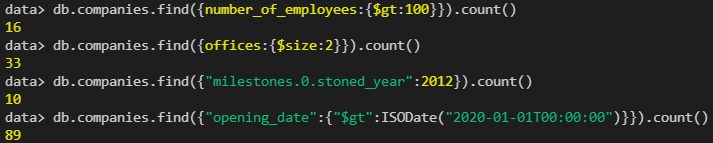
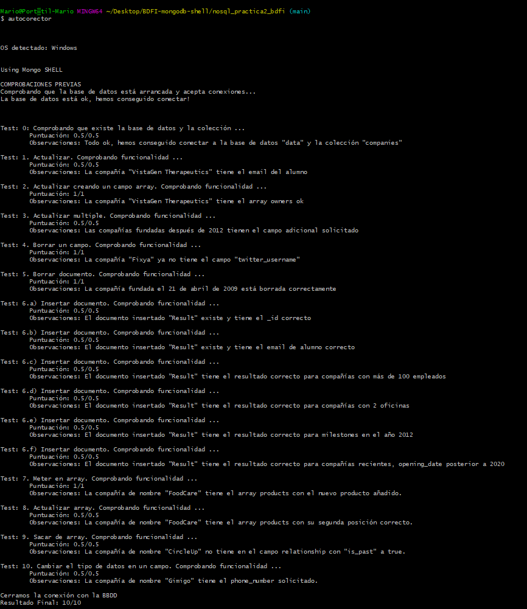

# BDFI-mongodb-shell
# Uso de la Shell de MongoDB
## Objetivos
Utilizar la Mongo Shell con una colección inicialmente desconocida. Examinarla y hacer
búsquedas y actualizaciones de sus documentos.

## Enunciado e instrucciones resumidas
Bajar el archivo companies_833_v2.json que está en Moodle e importarlo a nuestra base de datos.

### Tareas a realizar: Usando la Mongo Shell 
1. Actualizar
2. Actualizar creando un campo array
3. Actualizar múltiple
4. Borrar un campo
5. Borrar un documento
6. Insertar documento con resultados de "count"
7. Meter en array
8. Actualizar array
9. Sacar de array
10. Cambiar el tipo de datos en un campo

### Probar la práctica y subir la nota a Moodle empleando el autocorrector

## Pasos realizados y Resultados

### 0. Instalación de herramientas necesarias y conexión a base de datos

Para la realización de la práctica es necesario tener instalados:

1. MongoDB Community Edition
2. MongoDB Compass
3. MongoDB Shell (mongosh)
4. MongoDB Database Tools
4. Git
5. Node
6. Npm
7. Autocorector. Una vez instalado node, el autocorector se instala con:
```
npm install -g autocorector
```

Se descarga al archivo `companies.json` y se importa a la base de datos de MongoDB mediante:

```
cd 'C:\Program Files\MongoDB\Server\5.0\bin\'
.\mongoimport.exe -d data -c companies --file 'C:\Users\mario\Desktop\BDFI-mongodb-shell'
```

Se inicia el mongo shell:
```
cd C:\Users\mario\AppData\Local\Programs\mongosh\
mongosh.exe
```

Usar la BBDD data: 
```
> use data
```

### 1. Actualizar 
En la compañía de nombre "VistaGen Therapeutics", añadirle como email_address tu email de alumno upm (acabado en @alumnos.upm.es)

```
> db.companies.updateOne({name: "VistaGen Therapeutics"},{$set:{email_address:"m.esperalta@alumnos.upm.es"}})
```
Para comprobar que se ha cambiado correctamente:
```
> db.companies.find({name:"VistaGen Therapeutics"},{email_address:1})
```

### 2. Actualizar creando un campo array
En la compañía de nombre "VistaGen Therapeutics" queremos que haya un nuevo campo “owners” que sea un array y que inicialmente tenga solo un documento con valor:
`{ nombre: TU_NOMBRE, token: TU_TOKEN_DE_MOODLE }`
```
> db.companies.updateOne({name:"VistaGen Therapeutics"},{$set:{owners: {nombre: "Mario", token: "TOKEN DE MOODLE" }}})
```

### 3. Actualizar múltiple
En TODAS las compañías fundadas en 2012 o posterior, añadir un campo adicional a
los existentes que ponga:
`uptodate: true`
```
> db.companies.updateMany({founded_year:{$gte:2012}},{$set:{uptodate: true}})
```

### 4. Borrar un campo
En la compañía de nombre "Fixya" borra el campo “twitter_username” (solo ese campo, no todo el documento)
```
> db.companies.updateOne({name:"Fixya"},{$unset:{"twitter_username":""}})
```


### 5. Borrar documento
Borra la compañía fundada el 21 de abril de 2009.
```
> db.companies.deleteOne({founded_year:2009,founded_month:4,founded_day:21})
```


### 6. Insertar documento con resultados de “count” (contar)
En este apartado haremos varias queries de búsqueda sobre la colección y guardaremos los resultados en una nueva colección de nombre “results”.

6.a) Contar cuantas compañías tienen más de 100 empleados.

6.b) Contar cuantas compañías tienen 2 oficinas.

6.c) Contar cuantas compañías tienen en el primero de sus milestones en el año 2012.

(campo stoned_year dentro del array de milestones).

6.d) Contar cuantas compañías tienen el campo opening_date que es de tipo fecha (Date o ISODate) posterior al año 2020 (usar new ISODate(“2020-01-01”)).



Con estos cuatro datos crear un documento como sigue e insertarlo en la misma base de datos (companies) en una colección nueva de nombre “results”. Es decir habrá ahora dos colecciones, “companies” y “results” en la misma base de datos de nombre “data”.
```
db.results.insertOne(
    {
    _id: 1,
    email: "m.esperalta@alumnos.upm.es",
    results: {
        mas_empleados: 16,
        dos_oficinas: 33,
        m_2012: 10,
        recientes: 89
    }
    }
)
```

### 7. Meter en array
La compañía de nombre “FoodCare”, añade al array de products un nuevo producto, con el campo “name” y valor “Future Edition” y campo “permalink” valor “future-edition”
```
db.companies.update({name:"FoodCare"},{$push:{products:{name:"Future Edition", permalink:"future-edition"}}})
```

### 8. Actualizar array
La compañía de nombre “FoodCare”, en el array de products, que la segunda posición en lugar de "Corporate Edition" diga “Company Edition”
```
db.companies.updateOne({"name":"FoodCare"},{$set:{"products.1.name":"Company Edition"}})
```

### 9. Sacar de array
En la compañía de nombre “CircleUp”, en el campo relationships, quita aquellas que tengan el campo “is_past” a true
```
db.companies.update({"name":"CircleUp"},{$pull: {relationships: {is_past:true}}})
```

### 10. Cambiar el tipo de datos en un campo
La compañía de nombre “Gimigo”, queremos que su teléfono sea el mismo que tiene pero sin los paréntesis ni guiones, siendo un Number en lugar de un string.

Se mira el campo en la base de datos en su formato string y se hace upload con su valor en number.
```
db.companies.find({name:"Gimigo"},{phone_number:1})
db.companies.update({name:"Gimigo"},{$set: {phone_number:2065382800}})
```

### 11. Evaluación mediante autocorector


